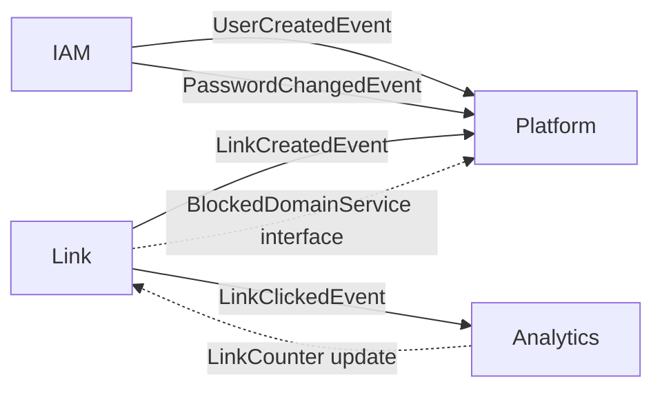

# URL Shortener — Modular Monolith Backend

## Tổng quan

Xây dựng hệ thống backend cho URL Shortener dựa trên Spring Boot 4.0.6 + Java 21, sử dụng kiến trúc **Modular Monolith** (package-by-feature). Mỗi PostgreSQL schema (`iam`, `link`, `analytics`, `platform`) tương ứng với một module trong codebase, giao tiếp qua **Spring Application Events** thay vì gọi trực tiếp service.

**Tech Stack hiện có trong POM:**
- Spring Boot 4.0.6, Java 21, Lombok
- Spring Data JPA, Spring Security + OAuth2 Resource Server
- PostgreSQL, Flyway, Redis, Spring Cache, Actuator
- Testcontainers (testing)

---

## Cấu trúc Package (Modular Monolith)

```
com.ThanhND05.url_shortener/
├── UrlShortenerApplication.java
├── common/                          ← Shared Kernel
│   ├── config/                      ← Security, Redis, JPA configs
│   ├── dto/                         ← ApiResponse, PageResponse, ErrorResponse
│   ├── exception/                   ← Global exception handler + custom exceptions
│   ├── security/                    ← JWT provider, filters, UserPrincipal
│   └── util/                        ← Hash utils, Base62 encoder, IP utils
│
├── iam/                             ← Module IAM
│   ├── controller/                  ← AuthController, UserController, RoleController, ApiKeyController
│   ├── dto/                         ← Request/Response DTOs
│   ├── entity/                      ← User, RefreshToken, TokenBlacklist, Role, Permission, UserRole, ApiKey
│   ├── repository/                  ← JPA Repositories
│   ├── service/                     ← AuthService, UserService, RoleService, PermissionService, ApiKeyService
│   └── event/                       ← UserCreatedEvent, PasswordChangedEvent, AccountLockedEvent
│
├── link/                            ← Module Link
│   ├── controller/                  ← LinkController, DomainController, TagController, RedirectController
│   ├── dto/
│   ├── entity/                      ← Link, Domain, RedirectLookup, LinkRule, Tag, LinkTag
│   ├── repository/
│   ├── service/                     ← LinkService, DomainService, RedirectService, TagService, ShortCodeGenerator
│   └── event/                       ← LinkCreatedEvent, LinkClickedEvent
│
├── analytics/                       ← Module Analytics
│   ├── controller/                  ← AnalyticsController
│   ├── dto/
│   ├── entity/                      ← ClickEvent, ClickAggMinute, ClickAggDaily, LinkCounter
│   ├── repository/
│   ├── service/                     ← ClickTrackingService, AggregationService, AnalyticsQueryService
│   └── listener/                    ← LinkClickedEventListener
│
└── platform/                        ← Module Platform
    ├── controller/                  ← AuditLogController
    ├── dto/
    ├── entity/                      ← OutboxEvent, IdempotencyKey, AuditLog, BlockedDomain
    ├── repository/
    ├── service/                     ← OutboxService, IdempotencyService, AuditService, BlockedDomainService
    └── listener/                    ← Catch-all event listener for audit logging
```

---

## Proposed Changes

### Phase 1: Foundation (common + config + Flyway)

#### [NEW] `src/main/resources/db/migration/V1__init_schema.sql`
- Đặt toàn bộ SQL schema mà user đã cung cấp làm Flyway migration V1.

#### [MODIFY] `src/main/resources/application.yaml`
- Cấu hình datasource PostgreSQL, Flyway, Redis, JWT, JPA.
- Profile `dev` / `prod` riêng biệt.

#### [NEW] `common/config/JpaConfig.java`
- Enable JPA auditing, cấu hình `AuditorAware`.

#### [NEW] `common/config/SecurityConfig.java`
- SecurityFilterChain: public endpoints (`/api/v1/auth/**`, `/{shortCode}` redirect), protected endpoints.
- JWT token validation filter.
- CORS configuration.

#### [NEW] `common/config/RedisConfig.java`
- CacheManager configuration cho redirect lookup cache.

#### [NEW] `common/security/JwtProvider.java`
- Generate access token (15 min) + refresh token (7 days).
- Parse/validate JWT, extract claims.
- JTI generation cho blacklist support.

#### [NEW] `common/security/JwtAuthenticationFilter.java`
- OncePerRequestFilter: extract Bearer token, validate, set SecurityContext.

#### [NEW] `common/security/UserPrincipal.java`
- Implements `UserDetails` — wraps User entity.

#### [NEW] `common/security/ApiKeyAuthenticationFilter.java`
- Filter cho API key authentication (header: `X-API-Key`).

#### [NEW] `common/dto/ApiResponse.java`
- Generic wrapper: `{ success, data, message, timestamp }`.

#### [NEW] `common/dto/PageResponse.java`
- Paginated response: `{ content, page, size, totalElements, totalPages }`.

#### [NEW] `common/exception/`
- `ResourceNotFoundException`, `DuplicateResourceException`, `BusinessException`, `UnauthorizedException`.
- `GlobalExceptionHandler` (`@RestControllerAdvice`).

#### [NEW] `common/util/HashUtil.java`
- SHA-256 hashing cho password, URL, IP, user-agent.

#### [NEW] `common/util/Base62Encoder.java`
- Encode sequence number sang Base62 cho short code generation.

---

### Phase 2: Module IAM

#### Entities (JPA mapping → schema `iam`)

| Entity | Table | Ghi chú |
|--------|-------|---------|
| `User` | `iam.users` | `@Table(schema="iam")`, soft delete via `deleted_at` |
| `RefreshToken` | `iam.refresh_tokens` | Family rotation, session tracking |
| `TokenBlacklist` | `iam.token_blacklist` | Emergency revocation |
| `Role` | `iam.roles` | System + custom roles |
| `Permission` | `iam.permissions` | Resource:action model |
| `RolePermission` | `iam.role_permissions` | M:N join |
| `UserRole` | `iam.user_roles` | Scoped (GLOBAL/WORKSPACE) |
| `ApiKey` | `iam.api_keys` | Scoped permissions as `TEXT[]` |

#### Controllers & Endpoints

**AuthController** (`/api/v1/auth`):
| Method | Path | Mô tả |
|--------|------|-------|
| POST | `/register` | Đăng ký user mới |
| POST | `/login` | Đăng nhập, trả access + refresh token |
| POST | `/refresh` | Rotate refresh token (family-based) |
| POST | `/logout` | Revoke refresh token + blacklist access |
| POST | `/logout-all` | Revoke all sessions |

**UserController** (`/api/v1/users`):
| Method | Path | Mô tả |
|--------|------|-------|
| GET | `/me` | Profile hiện tại |
| PUT | `/me` | Update profile |
| PUT | `/me/password` | Đổi mật khẩu → blacklist old tokens |
| GET | `/` | List users (admin) |
| PUT | `/{id}/status` | Lock/unlock user (admin) |

**RoleController** (`/api/v1/roles`):
| Method | Path | Mô tả |
|--------|------|-------|
| GET | `/` | List roles |
| POST | `/` | Create custom role |
| PUT | `/{id}/permissions` | Assign permissions |
| POST | `/users/{userId}/roles` | Assign role to user |

**ApiKeyController** (`/api/v1/api-keys`):
| Method | Path | Mô tả |
|--------|------|-------|
| POST | `/` | Create API key |
| GET | `/` | List my API keys |
| DELETE | `/{id}` | Revoke API key |

#### Services
- **AuthService**: Register, login (BCrypt verify), JWT issue, refresh token rotation (detect family reuse → revoke all), logout.
- **UserService**: CRUD, password change → publish `PasswordChangedEvent`.
- **RoleService**: CRUD roles, assign permissions, assign roles to users. Auto-bootstrap user roles on creation based on `system_role`.
- **PermissionService**: Query effective permissions (replicate `iam.user_effective_permissions` view logic).
- **ApiKeyService**: Create (generate prefix + hash), validate, revoke.

#### Events Published
- `UserCreatedEvent` → Platform module (audit log)
- `PasswordChangedEvent` → IAM internal (blacklist tokens) + Platform (audit)
- `AccountLockedEvent` → IAM internal (revoke all sessions)

---

### Phase 3: Module Link

#### Entities

| Entity | Table |
|--------|-------|
| `Domain` | `link.domains` |
| `Link` | `link.links` |
| `RedirectLookup` | `link.redirect_lookup` |
| `LinkRule` | `link.link_rules` |
| `Tag` | `link.tags` |
| `LinkTag` | `link.link_tags` |

#### Controllers & Endpoints

**DomainController** (`/api/v1/domains`):
| Method | Path | Mô tả |
|--------|------|-------|
| POST | `/` | Register custom domain |
| GET | `/` | List my domains |
| PUT | `/{id}/verify` | Verify domain ownership |
| PUT | `/{id}/default` | Set as default domain |
| DELETE | `/{id}` | Soft delete domain |

**LinkController** (`/api/v1/links`):
| Method | Path | Mô tả |
|--------|------|-------|
| POST | `/` | Create short link |
| GET | `/` | List my links (paged, filterable) |
| GET | `/{publicId}` | Get link details |
| PUT | `/{publicId}` | Update link |
| DELETE | `/{publicId}` | Soft delete |
| POST | `/{publicId}/rules` | Add routing rule |
| PUT | `/{publicId}/tags` | Set tags |
| GET | `/{publicId}/stats` | Quick stats |

**TagController** (`/api/v1/tags`):
| Method | Path | Mô tả |
|--------|------|-------|
| POST | `/` | Create tag |
| GET | `/` | List my tags |
| DELETE | `/{id}` | Delete tag |

**RedirectController** (`/{shortCode}` — public, no auth):
| Method | Path | Mô tả |
|--------|------|-------|
| GET | `/{shortCode}` | Redirect short URL → original URL |

#### Services
- **ShortCodeGenerator**: Sử dụng `link.short_code_seq` + Base62 encoding.
- **LinkService**: Create (validate blocked domains, generate short code, sync redirect_lookup), update, delete, pagination/search.
- **DomainService**: CRUD, verify, set default (unique constraint).
- **RedirectService**: Hot path — lookup from Redis cache first → fallback DB (`redirect_lookup`). Check status, expiry, max_clicks, password. Publish `LinkClickedEvent` async.
- **TagService**: CRUD tags, assign to links.

#### Caching Strategy (Redis)
- Key: `redirect:{domainId}:{shortCode}` → cached `RedirectLookup` object.
- TTL: 1 hour, evict on link update/delete.
- Cache-aside pattern.

---

### Phase 4: Module Analytics

#### Entities

| Entity | Table |
|--------|-------|
| `ClickEvent` | `analytics.click_events` (partitioned) |
| `ClickAggMinute` | `analytics.click_agg_minute` |
| `ClickAggDaily` | `analytics.click_agg_daily` |
| `LinkCounter` | `analytics.link_counters` |

#### Controller

**AnalyticsController** (`/api/v1/analytics`):
| Method | Path | Mô tả |
|--------|------|-------|
| GET | `/links/{publicId}/clicks` | Click events (paged) |
| GET | `/links/{publicId}/summary` | Aggregated summary |
| GET | `/links/{publicId}/timeseries` | Time-series data |
| GET | `/links/{publicId}/top-referrers` | Top referrers |
| GET | `/links/{publicId}/geo` | Geo distribution |
| GET | `/links/{publicId}/devices` | Device breakdown |

#### Services
- **ClickTrackingService**: Listen `LinkClickedEvent` → insert `click_events`, upsert `click_agg_minute`, update `link_counters`. Process async via `@Async`.
- **AggregationService**: Scheduled job (`@Scheduled`) — roll up minute → daily aggregations. Cleanup expired minute data (>7 days).
- **AnalyticsQueryService**: Query aggregations, build time-series, top-N queries.

---

### Phase 5: Module Platform

#### Entities

| Entity | Table |
|--------|-------|
| `OutboxEvent` | `platform.outbox_events` |
| `IdempotencyKey` | `platform.idempotency_keys` |
| `AuditLog` | `platform.audit_logs` |
| `BlockedDomain` | `platform.blocked_domains` |

#### Controllers

**AuditLogController** (`/api/v1/audit-logs`):
| Method | Path | Mô tả |
|--------|------|-------|
| GET | `/` | List audit logs (admin) |
| GET | `/users/{userId}` | Logs by user |

**BlockedDomainController** (`/api/v1/blocked-domains`):
| Method | Path | Mô tả |
|--------|------|-------|
| GET | `/` | List blocked domains |
| POST | `/` | Add blocked domain |
| DELETE | `/{id}` | Remove blocked domain |

#### Services
- **AuditService**: Listen to all domain events → insert audit log.
- **OutboxService**: Transactional outbox pattern — insert event in same TX, poller publishes.
- **IdempotencyService**: Check/store idempotency keys for mutating API calls.
- **BlockedDomainService**: CRUD + check method for Link module.

---

## Inter-Module Communication



- **Async events** (`ApplicationEventPublisher`): Cho side-effects (audit, analytics).
- **Direct interface call** (qua Spring bean): Chỉ cho read-only cross-module query khi event không phù hợp (vd: check blocked domain trước khi tạo link).

---

## Security Architecture

```
Request → JwtAuthenticationFilter / ApiKeyAuthenticationFilter
        → SecurityContext (UserPrincipal with permissions)
        → @PreAuthorize("hasPermission('link', 'create')")
        → Controller → Service
```

- **Access Token**: JWT, 15 min TTL, chứa userId, roles, permissions.
- **Refresh Token**: Stored in DB, family rotation, 7 days TTL.
- **API Key**: Header `X-API-Key`, scoped permissions, rate limited.
- **Password**: BCrypt hashing.

---

## Danh sách file cần tạo (ước tính ~80+ files)

### Common (~15 files)
### IAM (~25 files)
### Link (~20 files)
### Analytics (~12 files)
### Platform (~12 files)

---

## Open Questions

> [!IMPORTANT]
> 1. **Database connection**: Bạn đã có PostgreSQL instance chạy chưa? Cần tôi cấu hình connection string như thế nào? (host, port, database name, username, password)
> 2. **Redis**: Bạn đã có Redis instance chưa? Hay cần tôi thêm Docker Compose?

> [!WARNING]
> 3. **Spring Boot 4.0.6**: Đây là version rất mới. Một số thư viện (như `jjwt` cho JWT) có thể chưa hoàn toàn tương thích. Tôi sẽ dùng `spring-security-oauth2-resource-server` có sẵn trong POM để handle JWT (dùng Nimbus JOSE thay vì jjwt). Bạn OK với approach này không?

> [!NOTE]
> 4. **Scope**: Do project rất lớn (~80+ files), tôi sẽ chia thành 5 phase và implement tuần tự. Phase 1 (Foundation) → Phase 2 (IAM + Auth) → Phase 3 (Link + Redirect) → Phase 4 (Analytics) → Phase 5 (Platform). Bạn muốn tôi implement tất cả hay chỉ một số phase trước?

---

## Verification Plan

### Automated Tests
- Compile check: `mvn compile` phải pass.
- Unit tests cho core services.
- Integration tests với Testcontainers (PostgreSQL + Redis).

### Manual Verification
- Test auth flow (register → login → refresh → logout).
- Test link creation → redirect → analytics tracking.
- Verify Flyway migration chạy đúng schema.
